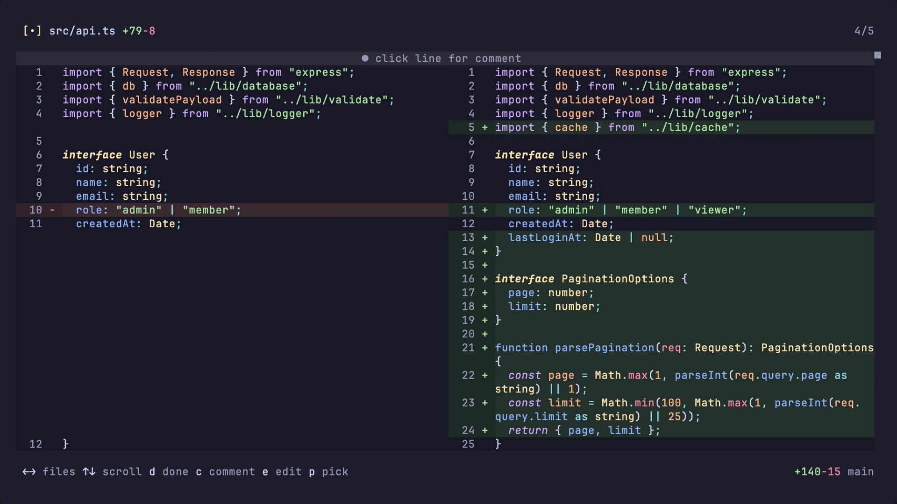

<h1 align="center">diffgotchi</h1>

<p align="center">
  
</p>

<p align="center">
  <a href="https://diffgotchi.dev">diffgotchi.dev</a> · <a href="#install">install</a> · <a href="#quick-start">quick start</a> · <a href="#what-you-get">what you get</a> · <a href="#agents-can-use-diffgotchi-too">agents</a> · <a href="#configuration">configuration</a> · <a href="#docs">docs</a>
</p>

---



**terminal diff reviewer for the code your agent writes.**

scroll the diff. drop comments where the patch needs work. mark files done. hand
the loop back to your agent and come back to a green panel.

---

> [!NOTE]
> built with agents, for agent-driven code review. diffgotchi is designed for the
> moment after an ai agent changes your code: you review the diff, leave precise
> line comments, and let the agent read and resolve them.

## install

```bash
brew install oswaldoacauan/tap/diffgotchi
```

macos and linux are available through homebrew. other builds live on the
[releases page](https://github.com/oswaldoacauan/diffgotchi/releases).

## quick start

run it inside a git repo:

```bash
cd your-repo
diffgotchi
```

by default, diffgotchi reviews your unstaged changes, the same patch you would
see from `git diff`.

common variants:

```bash
diffgotchi --staged                # staged changes
diffgotchi main                    # diff vs main (base...HEAD)
diffgotchi main feat               # diff between two refs (base...head)
diffgotchi --commit abc123         # one commit
diffgotchi --filter "*.tsx"        # only files matching a glob
diffgotchi --session api-review    # named review session
```

watch mode is always on. keep diffgotchi open while your agent works and the
diff refreshes when files change.

## what you get

- **terminal-native review**: scroll files, jump hunks, fuzzy-pick paths, and
  open the current file in `$EDITOR`.
- **mouse-aware comments**: click a changed line or press `c` to leave a note
  exactly where the problem lives.
- **done state**: mark files done as you review them and keep your place across
  runs.
- **review sessions**: use `--session` when one branch has multiple parallel
  reviews.
- **agent-readable state**: comments, replies, and resolutions persist under
  `.git/diffgotchi/`.
- **agent skill**: install the diffgotchi skill so your agent can list comments,
  reply, and resolve threads from the shell.
- **themes and keybinds**: 30 built-in themes, command palette, mouse support,
  and remappable keys.

useful keys:

| key             | action                            |
| --------------- | --------------------------------- |
| `←` `→` / `h l` | previous / next file              |
| `↑` `↓` / `j k` | scroll                            |
| `[` / `]`       | previous / next hunk              |
| `d`             | mark current file done            |
| `c`             | add a comment on the focused line |
| `ctrl+k r`      | open the comments panel           |
| `/`             | fuzzy file picker                 |
| `ctrl+p`        | command palette                   |
| `ctrl+g`        | open current file in `$EDITOR`    |
| `ctrl+c`        | quit                              |

## agents can use diffgotchi too

diffgotchi is not just a tui. it also exposes the review as structured data, so
your coding agent can read what you wrote, make changes, reply, and resolve the
thread.

the intended loop:

1. ask your agent to make a change.
2. run `diffgotchi` and review the patch.
3. leave comments on the lines that need work.
4. tell the agent: "read my open diffgotchi comments and address them."
5. the agent uses `diffgotchi --json`, fixes the code, replies, and resolves
   the comments it handled.

install the skill:

```bash
npx skills add oswaldoacauan/diffgotchi
```

the skill also lives in
[`skills/diffgotchi/SKILL.md`](skills/diffgotchi/SKILL.md). drop it into claude
code, codex, or any agent that can run shell commands.

if you want to drive the loop yourself, every `review` command supports
`--json`:

```bash
diffgotchi --json review comments list --status open
diffgotchi --json review comments resolve cmt_123
diffgotchi --json review sessions list
diffgotchi --json review doctor
```

the response is always a stable envelope:

```json
{ "ok": true, "command": "review.comments.list", "comments": [] }
```

errors use the same shape:

```json
{ "ok": false, "error": { "code": "...", "message": "...", "details": {} } }
```

## configuration

config lives at:

```text
~/.config/diffgotchi/config.json
```

example:

```json
{
  "$schema": "https://diffgotchi.dev/schemas/config.json",
  "general": {
    "theme": "catppuccin",
    "mouse": true
  },
  "display": {
    "wrap": "word"
  },
  "diff": {
    "context_lines": 6,
    "refresh_debounce_ms": 200
  },
  "keybinds": {
    "diff.mark_done": "space",
    "diff.scroll_top": "g g",
    "file_picker.toggle_done": "ctrl+d",
    "global.quit": "ctrl+c"
  }
}
```

keybind strings use commas for alternatives and spaces for chords. for example,
`ctrl+g, ctrl+k e` means either `ctrl+g` or the two-step chord `ctrl+k` then
`e`.

custom themes go in:

```text
~/.config/diffgotchi/themes/*.json
```

## docs

- [getting started](https://diffgotchi.dev/docs/getting-started)
- [usage](https://diffgotchi.dev/docs/usage)
- [releases](https://github.com/oswaldoacauan/diffgotchi/releases)

## license

mit
